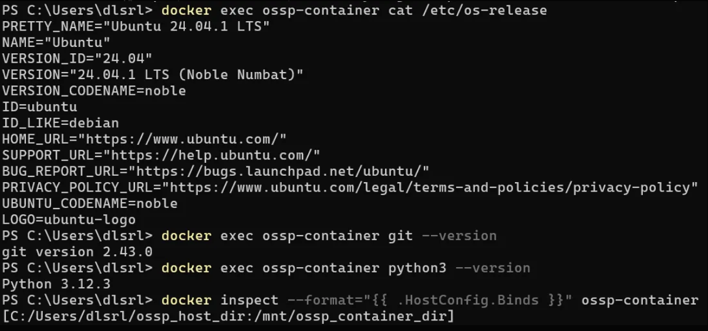

# SWE_2021_41_2024_2_week_6
## Week 4 Assignment
*Make function that determine if a number n is Happy number*
- **[Repository](https://github.com/p0pular131/SWE_2021_41_2024_2_week_4)**
- **Code Explain**
    - **Happy Number** :  
        - Starting with any positive integer, replace the number by the sum of the squares of its digits. 
        - Repeat the process until the number equals 1 (where it will stay), or it loops endlessly in a cycle which does not include 1.
        - Those numbers for which this process ends in 1 are happy.
    - **Happy function** 
        ```Python
        def isHappy(n):
            history = [] # list for passed number
            cur = n # var for current number

            while True :
                # if current number is 1, happy number
                if cur == 1 :
                    return True

                # check if it was processed
                if cur in history :
                    return False

                # if it wasn't, append it and caculate
                history.append(cur)

                # parse current number to list
                num_list = list(str(cur))
                cur = 0

                # square sum for each element
                for elem in num_list:
                cur += int(elem)**2
        return
        ```
    - **Test case**
        - Testcase 1.    

            ```
            input : 19   
            ouput : True   
            ```   
            Explain :    
            *1x1 + 9x9 = 82   
            8x8 + 2x2 = 68   
            6x6 + 8x8 = 100   
            1x1 + 0 + 0 = 1*    
            (happy number ! -> true)

        - Testcase 2.    

            ```
            input : 2   
            ouput : False   
            ```   
            Explain :    
            *2x2 = 4   
            4x4 = 16   
            1x1 + 6x6 = 37   
            9x9 + 7x7 = 58   
            5x5 + 8x8 = 89   
            8x8 + 9x9 = 145   
            1x1 + 4x4 + 5x5 = 42   
            4x4 + 2x2 = 20   
            2x2 + 0 = 4*    
            ...
            (infinity loop -> false)   

---
## Week 5 Assignment
>***Set Ubuntu environment using Docker***  
>>**The requirement environment is followed**  
>>- Linux OS
>>- Git installed
>>- Python3 installed
>>- Bind mounts  

Let's make the container named 'ubuntu-container' step by step !

---
 1. **Pull** ubuntu docker images
    ```
    docker pull ubuntu
    ```
    ---
 2. Make the directory to share with your container and make some text to test **Bind** works
    ```
    mkdir ossp_host_dir
    cd ossp_host_dir && vim shared_file.txt
    ```
    ---
 3. **Run** the docker container named 'ubunt-container' using **Bind mounts**   
    ```
    docker run -dit --nmae ossp-container -v <your_absolute_path>:/mnt/ossp_container_dir ubuntu
    ```
    ---
 4. **Attach** to 'ubuntu-container' for work in the container
    ```
    docker attach ossp-container
    ```
    ---
 5. *In your docker container*, install git & python3  
    ```
    apt-get update && apt-get install -y git python3
    ```
    and check using 
    ```
    git --version && python3 --version
    ```
    if it is not errored, well done and then command ```exit``` to exit. 

    ---
 6. Check your container's environment using followed command *outside of docker container*
    

    First, you must start your container
    ```
    docker start ossp-container
    ```
    And check the environment using followed command
    ```
    docker exec ossp-container cat /etc/os-release
    docker exec ossp-container git --version
    docker exec ossp-container python3 --version
    docker inspect --format="{{ .HostConfig.Binds }}" ossp-container
    ```
    And expecting result is followed 

    

    ---   
